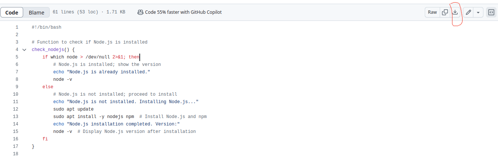

# Pictionary
Simple Pictionary gmae using node.js and socket.io

You can use bash script to deploy this application on your local server.  
<a href="./deploy.sh">Go to deploy.sh</a>

Instruction  for using the script
1. You need to download the file by clicking on **Go to deploy.sh**, you will be navigated to depoly.sh file page and then click on icon as shown in the image below.  
  

2. open the terminal and navigate to the folder where the file is downloaded using **cd** command.  

3. now run the command -->   **chmod +x deploy.sh**  

4. now just put this in your terminal -->  **./deploy.sh**  